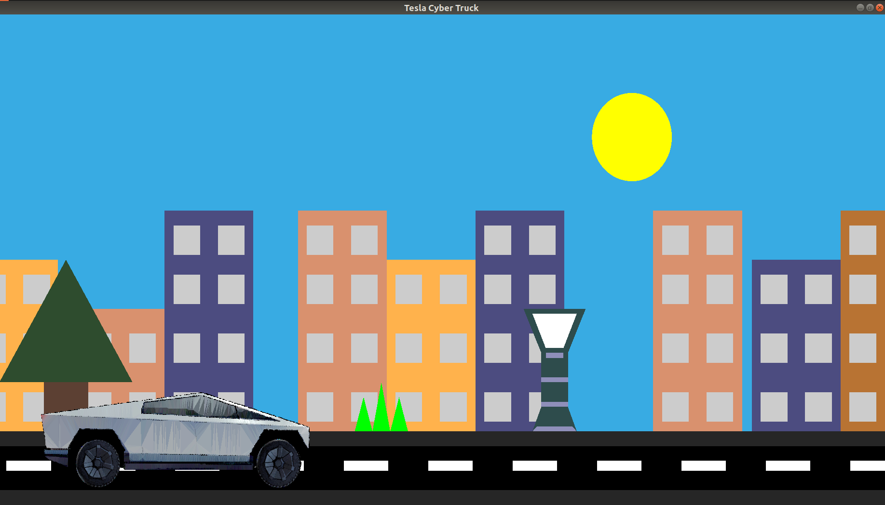

# Tesla Cyber Truck!
A simple project in Opengl which shows  Tesla Cyber Truck moving on the road and various environmental changes happening around in nature.

# Commands to get you working with the project (provided you have installed OpenGL :D !):
$ gcc caraccelr.c -lGL -lGLU -lglut -lm 
$ ./a.out

# PIC

Special thanks to <strong>Snorpey</strong>.  https://github.com/snorpey/triangulation
